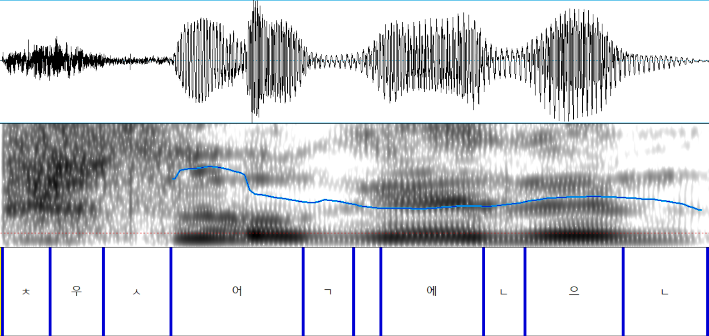
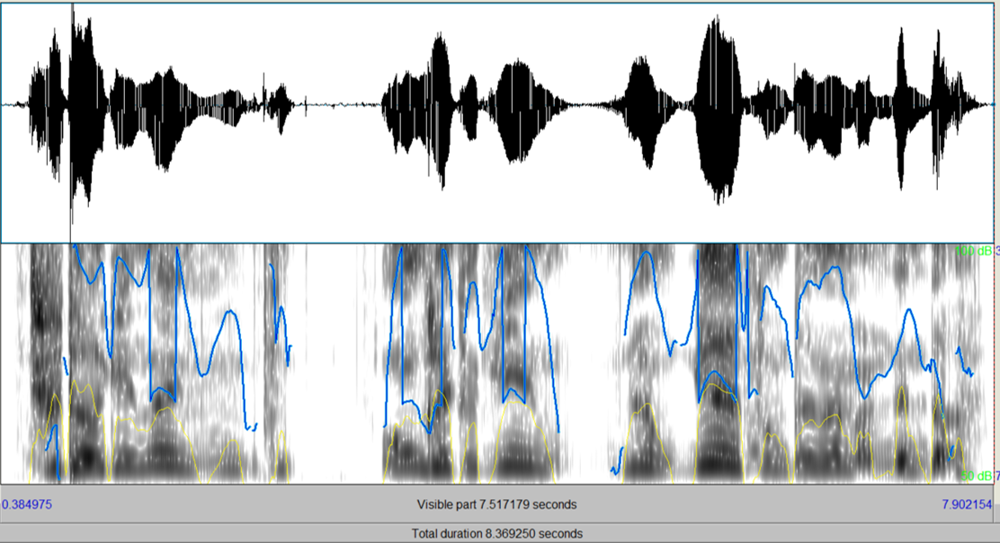
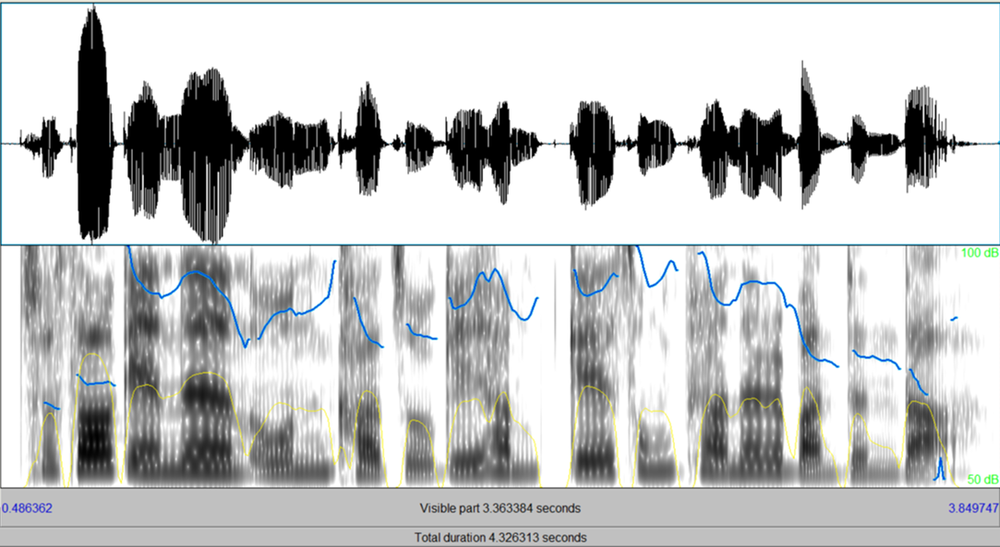
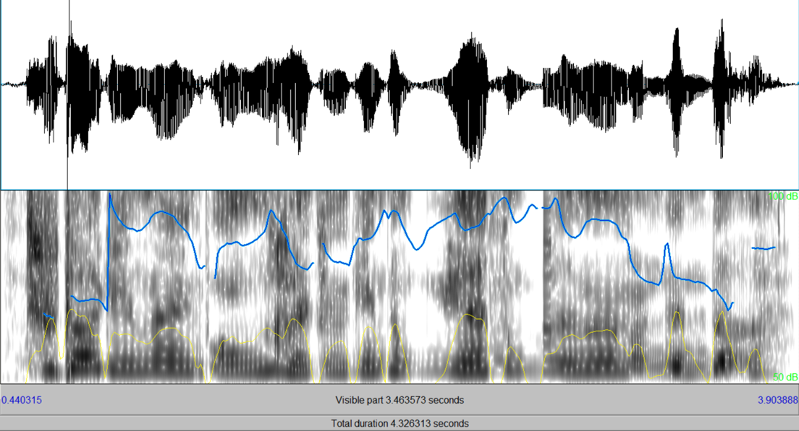
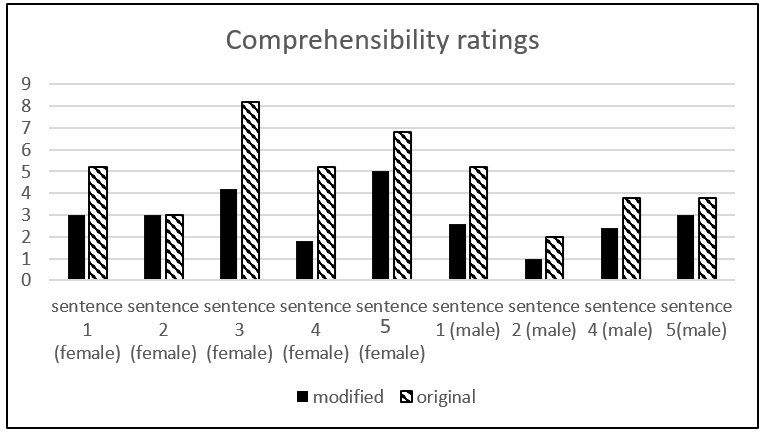

## Voice conversion/cloning for improving dysarthric speech (Korean & English)
&nbsp;
### ****Still working on uploading audio, adding the references, and completing part 3...
&nbsp;
&nbsp;
- This repository is my own personal testing gorunds for improving dysarthric speech.
- Some of the contents are from projects during my Masters program at Seoul National University.

### Table of Contents
  1. What is dysarthria
  2. Prosody-based voice cloning (PSOLA)
  3. Transfer learning based voice cloning (DNN-TTS)
  
  
  
 ### 1. What is Dysarthria?
 - Dysarthria is group of speech disorderes affecting multiple aspects of speech production. While issues in articulation tend to be th most salient cue of dysarthric speech, prosodic abnormalities can also be present.
 - Since dysarthric speech can be difficult to understand, especially at the severe levels, it would be useful if we can adjust the speech signal to sound more healthy.
 
### 2. Prosody-based voice cloning (PSOLA)
  - The following work was part of a small project for a Phonetics course focusing on prosody.
    - "Influence of prosody on dysarthric speech comprehensibility" (2019).
  - Purpose of study was to see whether modifying the pitch and duration of dysarthric speech into healthy speech would lead to better comprehension from native speakers.
    
#### Why prosody?
- Several studies have shown that the prosodic qualities of dysarthric speech differs from healthy speech.
- For example:
  - Flattened F0 leading to monotonic speech [1]
  - Overall higher F0 for severe dysarthria [2]
- This also appears to be language independent since similar results have been shown with Korean speakers [3-5].
- Lastly, despite the impaired and flattened F0 of dysarhtric speech, native listeners still have higher intelligibilty rating compared to modifying the signal to have a completely flat F0 [6,7].

#### PSOLA algorithm (Pitch Synchronous Overlap and Add)
- PSOLA works by dividing the speech waveform in small overlapping segments.
- To change the pitch of the signal, the segments are moved further apart (to decrease the pitch) or closer together (to increase the pitch).
- To change the duration of the signal, the segments are then repeated multiple times (to increase the duration) or some are eliminated (to decrease the duration).
  - 
  
### Task (using Praat)
1. Generate phone-based alignments from a given speech sample for both healthy and dysarthric speech. 
   
2. Clone the pitch and duration of healthy speech phones and apply them to the dysarthric speech phones.
  - This is an example of one speakers transformation saying: 추석에는 온 가족이 함께 송편을 만든다. 
   
  - This is the same sentence but from a healthy speaker (note the pitch and duration differences).
   
  - This is the cloned sentence from the dysarthric speech (note the pitch and duration).
   
  

### Perception task results
- I had native listners rate original and modified speech samples using a 1-9 compregensibility scale.
  - The lower the rating the easier it is to understand the sentence while higher ratings means it was more difficult to understand the sentences.
  - As seen from the chart below, in most cases the modified speech was easier to understand.
   
