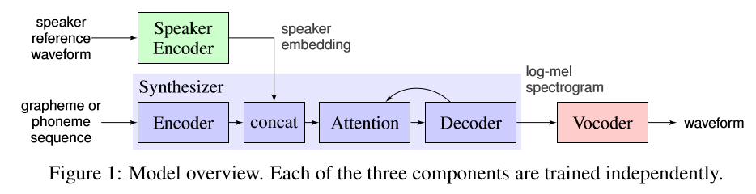

## Voice conversion/cloning for improving dysarthric speech (Korean & English)
&nbsp;
### ****Still working on completing part 3...
&nbsp;
&nbsp;
- This repository is my own personal testing gorunds for improving dysarthric speech.
- Some of the contents are from projects during my Masters program at Seoul National University.
- Korean audio comes from the QoLT database [1].
- English audio data comes from the TORGO database http://www.cs.toronto.edu/~complingweb/data/TORGO/torgo.html

### Table of Contents
1. What is dysarthria?
2. [Prosody-based voice cloning (PSOLA)](#prosody-based-voice-conversion) --> [audio samples](https://abnerling.github.io/dysarthria-audio-samples/)
  * [Why prosody?](#why-prosody)
  * [PSOLA algorithm](#psola-algorithm)
  * [Cloning task](#cloning-task-using-praat)
  * [Perceptual task results](#perceptual-task-results)
  3. [Transfer learning based voice cloning (DNN-TTS)](#transfer-learning-based-voice-cloning) --> [audio samples](https://abnerling.github.io/dysarthria-audio-samples/)
  
  
  
 ## What is Dysarthria?
 - Dysarthria is group of speech disorderes affecting multiple aspects of speech production. While issues in articulation tend to be th most salient cue of dysarthric speech, prosodic abnormalities can also be present.
 - Since dysarthric speech can be difficult to understand, especially at the severe levels, it would be useful if we can adjust the speech signal to sound more healthy.
 
## Prosody-based Voice Conversion
  - The following work was part of a small project for a Phonetics course focusing on prosody.
    - "Influence of prosody on dysarthric speech comprehensibility" (2019).
  - Purpose of study was to see whether modifying the pitch and duration of dysarthric speech into healthy speech would lead to better comprehension from native speakers.
    
#### Why prosody?
- Several studies have shown that the prosodic qualities of dysarthric speech differs from healthy speech.
- For example:
  - Flattened F0 leading to monotonic speech [2]
  - Overall higher F0 for severe dysarthria [3]
- This also appears to be language independent since similar results have been shown with Korean speakers [4-6].
- Lastly, despite the impaired and flattened F0 of dysarhtric speech, native listeners still have higher intelligibilty rating compared to modifying the signal to have a completely flat F0 [7,8].

#### PSOLA algorithm
- Pitch Synchronous Overlap and Add
- PSOLA works by dividing the speech waveform in small overlapping segments.
- To change the pitch of the signal, the segments are moved further apart (to decrease the pitch) or closer together (to increase the pitch).
- To change the duration of the signal, the segments are then repeated multiple times (to increase the duration) or some are eliminated (to decrease the duration).
  - 
  
#### Cloning Task using Praat
1. Generate phone-based alignments from a given speech sample for both healthy and dysarthric speech. 
   
2. Clone the pitch and duration of healthy speech phones and apply them to the dysarthric speech phones.
  - This is an example of one speakers transformation saying: 추석에는 온 가족이 함께 송편을 만든다. 
   
  - This is the same sentence but from a healthy speaker (note the pitch and duration differences).
   
  - This is the cloned sentence from the dysarthric speech (note the pitch and duration).
   
  - Click [here](https://abnerling.github.io/dysarthria-audio-samples/) to listen to some audio sameples.

#### Perceptual task results
- I had native listners rate original and modified speech samples using a 1-9 compregensibility scale.
  - The lower the rating the easier it is to understand the sentence while higher ratings means it was more difficult to understand the sentences.
  - As seen from the chart below, in most cases the modified speech was easier to understand.

## Transfer learning based voice cloning
#### Why use transfer learning?
  - While the PSOLA approach is intersting, it requires parallel data and forced alignment which is not feasible for a real life application.
  - Another approach is to use voice cloning, where the speakers voice charactertics are captured by a neural network allowing the user to input **any** sentence via a TTS-based system.
  - This could be helpful for indivduals with impaired speech to prepare presentations or speeches in their own voice.
  - The following is a personal project to see if I could apply transfer learning to dysarthric speech in order to improve intelligibilty.
  
 #### Training Process
- In order to apply a TTS-based voice clone for dysarthric speech I used the model [9] which was trained on English data.
 - Refer to the article for more detailed information regarding the model.
 - The code I used was from this repo https://github.com/CorentinJ/Real-Time-Voice-Cloning
  
 - This system is based on 3 components
  1. Speaker Encoder
   - Computes a fixed dimensional vector from a speech signal.
  2. Synthesizer
   - Predicts a melspectrogram from a sequence of grapheme or phoneme inputs, conditioned on the speaker embedding vector.
  3. Vocoder
   -  An autoregressive WaveNet which converts the spectrogram into time domain waveforms.
  
 ### Dysarthric speech cloning
 - Since we want to improve intelligibility, the hope is that the speaker encoder only encodes linguistic information relating to the speaker and not any misarticualtions or speech errors.
 - This was tested on speakers with mild, moderate and severe dysarthria.
 - However, as expected the more severe the dysarthria, the lower the resemblance to the original speakers.
 - [Sample audio clips](https://abnerling.github.io/dysarthria-audio-samples/)
 

## References
[1]Choi, D. L., Kim, B. W., Lee, Y. J., Um, Y., & Chung, M. (2011, October). Design and creation of dysarthric speech database for development of QoLT software technology. In 2011 International Conference on Speech Database and Assessments (Oriental COCOSDA) (pp. 47-50). IEEE. 
[2] Bunton, K., Kent, R. D., Kent, J. F., & Rosenbek, J. C. (2000). Perceptuo-acoustic assessment of prosodic impairment in dysarthria. Clinical Linguistics & Phonetics, 14(1), 13-24. 
[3] Schlenck, K. J., Bettrich, R., & Willmes, K. (1993). Aspects of disturbed prosody in dysarthria. Clinical linguistics & phonetics, 7(2), 119-128. 
[4] Shin, H. B., & Ko, D. H. (2017). An aerodynamic and acoustic characteristics of Clear Speech in patients with Parkinson's disease. Phonetics and Speech Sciences, 9(3), 67-74.  
[5] Kang, Y., Yoon, K., Seong, C., & Park, H. (2012). A Preliminary Study of the Automated Assessment of Prosody in Patients with Parkinson’s Disease. Communication Sciences & Disorders, 17(2), 234-248.  
[6] Nam, H. W., & Kwon, D. H. (2005). Prosodic characteristics in the persons with spastic and athetoid cerebral palsy. 
[7] Patel, R. (2002). Prosodic Control in Severe Dysarthria. Journal of Speech, Language, and Hearing Research. 
[8] Bunton, K., Kent, R. D., Kent, J. F., & Duffy, J. R. (2001). The effects of flattening fundamental frequency contours on sentence intelligibility in speakers with dysarthria. Clinical Linguistics & Phonetics, 15(3), 181-193.
[9] Jia, Y., Zhang, Y., Weiss, R., Wang, Q., Shen, J., Ren, F., ... & Wu, Y. (2018). Transfer learning from speaker verification to multispeaker text-to-speech synthesis. In Advances in neural information processing systems (pp. 4480-4490).

